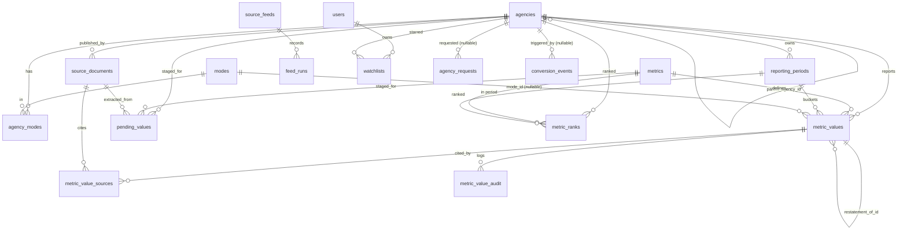

# TransitIndex — Concrete Schema Design
**Version:** 0.2 (decisions locked, pre-migration) | **Derived from:** data-model.md v0.2, source-registry.md v0.1, update-frequency.md v0.1, phase-plan.md v0.4

> **Purpose of this file.** `data-model.md` describes the *concept* (one flat metric layer,
> provenance-first, mixed-frequency). This file turns it into a *build-ready* schema: real
> types, constraints, indexes, and the invariants expressed as DB rules — plus the decisions
> that have to be made before the first migration is written. Nothing here is committed yet.
> The **GAP** markers are tables/fields the concept doc doesn't have yet.
>
> **Decisions resolved (2026-05-30, user):** 0 yes · 1 `text`+CHECK · 2 `text[]` · 3 **no**
> (drop the scope-caveat / small-player ranking guard — show structured data, let users choose
> who to compare; BC-Transit-Victoria handled later as its own entry) · 4 **no** (one value +
> many sources + a disagreement flag, *not* a second row) · 5 trigger · 6 **no** (only the
> ordinal rank "3rd" is shown, never "of N", so no minimum pool needed). **Plus:** archive raw
> non-API source files (PDFs, scraped pages) to cloud storage — link-rot insurance + lets a
> future extractor re-run without re-crawling.

---

## 0. The one boundary that shapes everything (GAP + DECISION)

`data-model.md` lumps `users` / `watchlists` in with the canonical metric tables, but
phase-plan.md's invariant is **"the web app only reads the data."** Those two facts conflict:
the web app *writes* users, watchlists, "request this agency" rows, and gate-funnel events.

**Resolution — two Postgres schemas in one database:**

| Schema | Who writes | Tables | Web app role |
|---|---|---|---|
| `core` | ingestion only | agencies, modes, metrics, metric_values, ranks, sources, … | **read-only** (SELECT) |
| `app` | web app only | users, watchlists, agency_requests, conversion_events | read-write |

This makes "web is a pure reader" *enforceable at the database role level* (grant the web role
`SELECT` on `core`, `ALL` on `app`) instead of by convention. Migrations stay plain SQL in one
place (phase-plan C1) — schemas are just namespaces inside the file set.

> **DECISION 0 — DECIDED: yes.** Adopt the `core` / `app` schema split — the only thing that
> makes the read-only invariant real rather than aspirational. Tables below are tagged
> `[core]` or `[app]`.

---

## 1. ERD



Boxes above the blank line are `[core]`; `users / watchlists / agency_requests /
conversion_events` are `[app]`.

---

## 2. Conventions (DECISION 1 + 2)

- **Primary keys:** `bigint generated always as identity`. Public-facing rows that need a
  stable external handle (`agencies`, `metrics`, `modes`) *also* get a unique `slug`/`code`
  text natural key. FKs point at the bigint.
- **Timestamps:** `timestamptz`, default `now()`.
- **Money / metric values:** `numeric` (unbounded precision). A single `value` column holds
  counts, ratios, and dollars; `metrics.unit` / `unit_type` say how to read it.

> **DECISION 1 — enum strategy (DECIDED: `text` + CHECK).** `data-model.md` says "enum" loosely. Three options:
> | Option | Pro | Con |
> |---|---|---|
> | native PG `CREATE TYPE … AS ENUM` | compact, self-documenting | adding a value = `ALTER TYPE`; can't remove values; awkward in tool-agnostic migrations |
> | **`text` + `CHECK (… IN (…))`** *(recommended)* | trivial to add values in a migration; language-agnostic | no central type object |
> | lookup table + FK | referential integrity, can carry metadata | a join for every read |
>
> Recommendation: **`text + CHECK`** for closed, attribute-free sets (`quality`,
> `service_scope`, `review_status`, `period_type`, …); keep `modes` and `metrics` as the
> tables they already are. Rationale: document types, licenses, and period types *will* grow
> as new sources/countries arrive — `ALTER TYPE` friction compounds. (CLAUDE.md: simplicity +
> future NTD pipeline staying tool-agnostic.)

> **DECISION 2 — array fields vs join tables (DECIDED: `text[]`).** `metrics.applicable_modes` and
> `agencies.primary_modes` are arrays in the concept doc. Postgres arrays **can't** carry a
> foreign key, so `applicable_modes text[]` of mode codes has no referential integrity.
> Options: keep `text[]` (simple, small, rarely edited) or add a `metric_applicable_modes`
> join table (integrity, heavier). Recommendation: **`text[]`** — these sets are tiny and
> change rarely; a CHECK or periodic validation catches typos. Flagging because it's a real
> trade.

---

## 3. `core` tables

### 3.1 `agencies` `[core]`
| Column | Type | Notes |
|---|---|---|
| id | bigint PK identity | |
| slug | text UNIQUE NOT NULL | `ttc`, `stm`, … |
| legal_name | text NOT NULL | |
| short_name | text | |
| country | text NOT NULL DEFAULT 'CA' | NTD-ready: US agencies later |
| subdivision | text NOT NULL | province/state code |
| service_area_population | integer | nullable — agency scale signal (replaces typology) |
| primary_modes | text[] | denormalized from `agency_modes` for fast filtering (DECISION 2; keep in sync) |
| fiscal_year_end_month | smallint NOT NULL DEFAULT 12 CHECK (1..12) | Metrolinx/BC Transit = 3 |
| currency | text NOT NULL DEFAULT 'CAD' | |
| parent_agency_id | bigint FK→agencies | nullable; BC Transit→sub-systems later |
| created_at / updated_at | timestamptz | |

**Index:** `(subdivision)` for directory grouping; `(parent_agency_id)`.

### 3.2 `modes` `[core]`
`id`, `code` UNIQUE (`bus`, `subway`, `light_rail`, `commuter_rail`, `streetcar`, `brt`,
`trolleybus`, `ferry`, `paratransit`, `on_demand`), `display_name`, `description`.

### 3.3 `agency_modes` `[core]` — M2M
`agency_id` FK, `mode_id` FK, `year_started` smallint, `status` text CHECK
(`active|planned|discontinued`). PK `(agency_id, mode_id)`.

### 3.4 `metrics` `[core]` — definitions, not values
| Column | Type | Notes |
|---|---|---|
| id | bigint PK | |
| code | text UNIQUE NOT NULL | `annual_ridership`, `farebox_recovery_ratio`, … |
| display_name | text NOT NULL | |
| description | text | |
| unit | text NOT NULL | `count`, `CAD`, `%`, `hours`, … |
| unit_type | text CHECK (…) | `count\|ratio\|currency\|time\|distance` |
| applicable_modes | text[] | NULL = universal/system-wide; array = mode-specific (replaces the old 3-layer enum) |
| is_derived | boolean NOT NULL DEFAULT false | |
| formula | text | e.g. `operating_revenue / operating_expenses` |
| higher_is_better | boolean | nullable = neutral (no good/bad framing) |
| cuta_reference | text | internal consistency only, never shown publicly |
| ntd_reference | text | future US field mapping |

### 3.5 `reporting_periods` `[core]`
| Column | Type | Notes |
|---|---|---|
| id | bigint PK | |
| agency_id | bigint FK NOT NULL | |
| period_type | text CHECK (…) NOT NULL | `monthly\|quarterly\|annual_calendar\|annual_fiscal\|ytd` |
| start_date | date NOT NULL | real dates, not a year label |
| end_date | date NOT NULL | |
| label | text NOT NULL | `"2024"`, `"FY2024-25"`, `"2024-Q3"`, `"Mar 2026"` |

**Unique** `(agency_id, period_type, start_date)`. **Load-bearing:** period type is
per-value, so TransLink carries monthly + quarterly + annual simultaneously
(update-frequency.md confirms this is real, not theoretical).

### 3.6 `metric_values` `[core]` — the heart
| Column | Type | Notes |
|---|---|---|
| id | bigint PK | |
| agency_id | bigint FK NOT NULL | |
| metric_id | bigint FK NOT NULL | |
| reporting_period_id | bigint FK NOT NULL | |
| mode_id | bigint FK | nullable = system-wide |
| service_scope | text CHECK (…) NOT NULL | `conventional\|specialized\|total\|system_wide` — **never summable across rows** |
| value | numeric NOT NULL | |
| unit | text NOT NULL | denormalized — guards against metric-definition drift |
| currency | text | nullable |
| quality | text CHECK (…) NOT NULL | `verified\|preliminary\|estimated\|imputed` |
| comparable_flag | boolean NOT NULL DEFAULT true | **default true = rank everything** (B: users choose comparisons). Set false only to *exclude a known-bad / mislabeled value* — not a small-player guard. |
| crosscheck_value | numeric | nullable — when a source *publishes* a figure we also compute (e.g. farebox), the published number rides here on the **one** record (C: single document). |
| crosscheck_source_document_id | bigint FK→source_documents | nullable — which source the crosscheck came from. Disagreement beyond tolerance raises the `cross_source_disagreement` flag. |
| restatement_of_id | bigint FK→metric_values | nullable; revision chain |
| is_current | boolean NOT NULL DEFAULT true | exactly one current value per tuple |
| notes | text | caveats |
| created_at / updated_at | timestamptz | |

**The one-current-value invariant** (data-model.md guarantee) as a real constraint —
PG16 supports `NULLS NOT DISTINCT`, which we need because `mode_id` is nullable:
```sql
CREATE UNIQUE INDEX one_current_value
  ON core.metric_values (agency_id, metric_id, reporting_period_id, mode_id, service_scope)
  NULLS NOT DISTINCT
  WHERE is_current;
```
**Sanity CHECKs:** counts non-negative where `unit_type='count'` (enforced in the recompute
job, not the column, since `value` is generic); farebox > 100% / negative cost surface as
flags, not hard rejects.
**Indexes:** `(agency_id, metric_id, reporting_period_id)`; `(metric_id, reporting_period_id)`
for rank cohorts.

### 3.7 `source_documents` `[core]`
`id`, `agency_id` FK, `document_type` text CHECK (`annual_report|quarterly_update|budget|
ceo_report|board_report|statcan_table|open_data_csv|gtfs|manual_entry|press_release`),
`title`, `publication_date` date, `source_url`, `archive_uri` (cloud-storage key of the saved
raw file), `file_hash` text, `license` text CHECK (`statcan_open|ogl_toronto|ogl_ottawa|
ogl_calgary|ogl_edmonton|ogl_montreal|ogl_metrovancouver|ogl_mississauga|public_document`),
`retrieved_at`, `verified_at`, `verified_by`. **`license` drives the mandatory attribution
string** — the exact text per license lives in source-registry.md §Attribution.

**Raw-file archive (user decision):** for every **non-API** source (PDF, scraped HTML page)
the raw file is saved to cloud storage at `archive_uri`; `file_hash` detects changes on
re-fetch. Two payoffs: provenance survives **link-rot** (the proof persists after the source
URL dies/changes), and a future/better extractor can **re-run on the stored originals without
re-crawling**. Clean API feeds (StatCan, open data) needn't be archived — they're re-pullable —
though snapshotting them is optional.

### 3.8 `metric_value_sources` `[core]` — links value→source(s)
`metric_value_id` FK, `source_document_id` FK, `page_number` int, `table_reference` text
(`"Table 4.2"`), `extraction_method` text CHECK (`manual|llm_assisted|structured_import|
statcan_passthrough`), `confidence` numeric CHECK (0..1). PK `(metric_value_id,
source_document_id)`. A value can have several sources (the published-vs-calculated cross-check).

### 3.9 `metric_value_audit` `[core]` — append-only (DECISION 5)
`id`, `metric_value_id` FK, `changed_at`, `changed_by`, `change_type` text, `old_value`
numeric, `new_value` numeric, `reason` text.

> **DECISION 5 — audit row writer (DECIDED: DB trigger).** A trigger on `metric_values`
> INSERT/UPDATE — enforced no matter which language/pipeline writes, honours phase-plan's
> "tool-agnostic contract" (vs app-level writes, where every future adapter must remember to
> do it).

### 3.10 `pending_values` `[core]` — staging (GAP: provenance fields added)
Same shape as `metric_values`, **plus** the provenance that must survive to promotion (the
concept doc only writes sources *on* approval, so the pending row has to carry them):
`source_document_id` FK, `page_number`, `table_reference`, `extraction_method`, `confidence`,
**plus** `review_status` text CHECK (`pending|approved|rejected|needs_edit`), `flags` text[]
(`yoy_spike|cross_source_disagreement|unit_mismatch|sum_mismatch`), `reviewer_notes`.
On approval → INSERT into `metric_values` + `metric_value_sources`. Tier-0 (StatCan, open
data) auto-approve; Tier-2 (PDFs) require human review.

### 3.11 `metric_ranks` `[core]` — materialized
`id`, `agency_id` FK, `metric_id` FK, `reporting_period_id` FK, `comparison_set` text CHECK
(`all|subdivision`), `rank` int, `denominator` int, `direction` text (from
`metrics.higher_is_better`; null = neutral), `computed_at`.
**Period-comparability rule** (data-model.md + design flag): rank within a single period
bucket at a matching `service_scope` — same period, same scope, **never across years**. An
agency missing that period is **not ranked** for it (UI: "not ranked — latest FYxxxx"). A value
left `comparable_flag=false` (known-bad/mislabeled) is excluded; otherwise every agency with a
value is ranked — **no minimum pool** (B). Refresh is **incremental** (only the touched
metric/period/comparison_set cohort) on promote/restate.

> **DECISION 6 — minimum denominator: DROPPED (user).** Only the ordinal rank ("3rd") is ever
> shown, never "of N", so pool size is invisible — nothing to suppress. (Sole leftover: a
> metric with a single agency can't be ranked at all; handled in display, not the schema.)

### 3.12 `source_feeds` + `feed_runs` `[core]` — GAP (feed health, an [accepted] item)
phase-plan accepts a "source-feed freshness/health alert," but there's no table for it.
- **`source_feeds`:** `id`, `code` (`statcan_307`, `edmonton_ridership`, …), `display_name`,
  `tier` smallint, `expected_cadence` text CHECK (`monthly|quarterly|annual`), `enabled` bool.
- **`feed_runs`** (append per run): `id`, `feed_id` FK, `started_at`, `finished_at`, `status`
  text CHECK (`ok|stalled|schema_break|error`), `rows_fetched` int, `schema_fingerprint` text,
  `last_good_at` timestamptz, `message` text.

This backs two committed behaviours: the **stale-feed UI state** ("as of" date muted + amber
"may be outdated" when past cadence) and the **cron alert** when a feed stalls/reshapes. On
schema break: serve last-good, never bad-as-fresh.

---

## 4. `app` tables (web-written)

### 4.1 `users` `[app]` (Phase 3, thin paid slice in M1)
`id`, `email` UNIQUE, `auth_provider`, `subscription_status` text CHECK
(`active|inactive|trialing|past_due`), `subscription_source` (stripe id, nullable), `created_at`.

### 4.2 `watchlists` `[app]` (Phase 3)
`user_id` FK, `agency_id` FK→core.agencies, `created_at`. PK `(user_id, agency_id)`.

### 4.3 `agency_requests` `[app]` — GAP ("request this agency", an [accepted] M1 item)
`id`, `agency_id` FK nullable (may be an agency not yet in the directory → free-text),
`requested_name` text, `email` text nullable, `created_at`. Pulls long-tail demand.

### 4.4 `conversion_events` `[app]` — GAP (gate-funnel instrumentation, [accepted] M1 item)
`id`, `event_type` text CHECK (`wall_hit|gate_view|checkout_start|paid`), `agency_id` FK
nullable (the triggering page), `user_id` FK nullable, `created_at`. Logs the funnel
wall-hit → gate-view → checkout-start → paid.

> Note: 4.3/4.4 are *anonymous* writes (no login for free browsing — phase-plan invariant).
> Keep them in `app` precisely so they never touch the read-only `core` surface.

---

## 5. Decisions — locked (2026-05-30)

| # | Decision | Outcome |
|---|---|---|
| 0 | `core` / `app` schema split | ✅ **Yes** — makes read-only enforceable |
| 1 | Enum strategy | ✅ **`text` + CHECK** (tool-agnostic, growth-friendly) |
| 2 | `applicable_modes` array vs join table | ✅ **`text[]`** (small, rarely edited) |
| 3 | Scope-caveat / small-player rank guard | ❌ **No** — show structured data, users choose comparisons. BC-Transit-Victoria becomes its **own entry** later (parent/child, Phase 4); it's last in build order. |
| 4 | Published-vs-calculated storage | ✅ **One value** + `crosscheck_value` + many sources + disagreement flag — *not* a second row (C: single document) |
| 5 | Audit row writer | ✅ **DB trigger** |
| 6 | Minimum rank denominator | ❌ **No** — only the ordinal rank is shown |
| + | Archive raw **non-API** source files to cloud | ✅ **Yes** — `archive_uri` (link-rot insurance + re-extraction) |
| 7 | Agency `typology` tag | ❌ **Dropped (2026-05-30)** — modes + `service_area_population` carry scale; `metric_ranks.comparison_set` → `all\|subdivision`. See lane-0-foundation-spec.md. |
| 8 | Launch metric catalog | ✅ **20 metrics** (14 sourced + 6 derived) — full financial-statement set. Seed detail in lane-0-foundation-spec.md + source-registry.md. |
| 9 | Balance-sheet expansion (2026-05-31) | ✅ Catalog **20 → 31** (+8 sourced balance-sheet lines, +3 derived). **No table migration** — `metric_values` absorbs them. Balance-sheet dollar lines carry `comparable_flag=false` (size, not performance; never ranked); only `debt_to_assets` + `net_debt_per_capita` rank. `crosscheck_value` now also holds the *printed* net debt from the PDF path. See [balance-sheet-and-frequency-plan.md](balance-sheet-and-frequency-plan.md). |

**Gaps I added beyond data-model.md** (the build needs them): `source_feeds` + `feed_runs`,
`agency_requests`, `conversion_events`, pending-value provenance fields, `crosscheck_value` +
`crosscheck_source_document_id`, and cloud `archive_uri` for raw source files.

---

## 6. What this does NOT cover yet (out of scope for this pass)
- Actual SQL migration files (**next step — decisions are now locked**).
- Seed rows for the 10 launch agencies / 9 universal metrics / modes.
- The rank-refresh and derived-recompute *job logic* (lives in `ingest/`, not the schema).
- DB roles/grants wiring (follows from DECISION 0).
- Drizzle/Prisma introspection types for `web/` (generated from the live schema, not authored).
